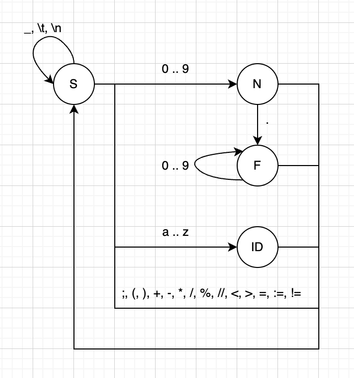

# PumLang

В рамках данного практикума мы попробуем реализовать интерпретатор языка программирования `PumLang`. Список требований к языку:
- **Переменные**. В языке обязательно должна быть сущность переменной, которой можно присвоить некоторое значение, затем это значение из переменной можно считать.
- **Строгая типизация**. До этого момента мы работали с языком `Python`, отличающегося динамической типизацией: переменные этого языка могли принимать значения разных типов. В языке `PumLang` это должно быть не так: при объявлении новой переменной программист должен будет указать тип данных, который она будет хранить.
- **Типы данных**. Требуется поддержка следующих типов данных: целые числа, вещественные числа и булевы значения (правда и истина).
- **Условный оператор**. Оператор условного перехода, позволяющий выполнять блок кода при соблюдении определенного условия.
- **Оператор цикла**. Оператор, позволяющий выполнять блок кода циклично, пока выполняется некоторое условие.
- **Обработка ошибок**. В случае, если в коде программы присутствует синтаксическая ошибка, интерпретатор должен корректно о ней сообщить: указать строку, в которой она произошла и кратко описать ее суть.
- **Ввод значения переменной**. Требуется, чтобы язык позволял ввести знаение переменной. Оно должно считываться с клавиатуры. Для реализации нуно будет просто вызвать Python-функцию `input()`
- **Вывод значения выражения на экран**. Требуется реализовать функцию, позволяющую отобразить значене выражения на экране.
- **Тотальный запрет библиотек и функции eval()**. Использовать можно только библиотеку `math`.

Далее будет предложен пример языка, удовлетворяющего всем этим требованиям. Синтаксис этого языка будет такой, чтобы максимально упростить все этапы интерпретации программы. Но никаких ограничений, кроме уже перечисленных, нет: если вы хотите создать нечто похожее на Lisp или Haskell, действуйте. Но учтите, что чем сложнее будет синтаксис языка, тем сложнее будет без ошибок интерпретировать программу. На этом этапе постарайтесь правильно оценить ситуацию. Взглянем на программу, написанную на `PumLang`. Несмотря на то, что вы еще ничего не знаете о его синтаксисе, думаю, вы без труда определите, что она делает.

```
{
    int n, s;
    input(n);
    s := 1;
    while (n > 1) {
        s := s * n;
        n := n - 1
    };
    print(s);
}
```
Итак, в первой строчке заводятся две целочиленные переменные, далее в одну из них считывается значение с клавиатуры. Второй переменной присваивается начальное значение 1. Далее в цикле мы уменьшаем одну переменную и домножаем на нее вторую. После цикла печатаем результат. Очевидно, что перед нами подсчет факториала.

После элементарного синтаксиса Python программа выглядит перегруженной, но все это сделано ради упрощения интерпретации нашего языка. Давайте попробуем составить так называемую грамматику для нашего языка, т.е. описать строгими правилами, какой должна быть программа, написанная на `PumLang`. Чтобы еще упростить себе жизнь, договоримся, что программа всегда завершается неким особым символом (мы можем добавлять его в конец строки перед интерпретацией). Например, `&`.

## Грамматика языка PumLang

```
P  -> B&
B  -> {S [;S]^}
S  -> [int | bool | float] I [,I]^ | I := E | if (E) B [else B] | while (E) B | input(I) | print(E)
E  -> E1 [[> | < | = | !=] E1]
E1 -> T [[+ | - | or] T]^
T  -> F [[* | / | % | // | and] F]^
F  -> I | N | L | not F | (E)
L  -> true | false
I  -> C[C]^
N  -> R[.R]
R  -> D[D]^
C  -> a | b | ... | z
D  -> 0 | 1 | ... | 9
```
Попробуем разобраться в написанном. Данная грамматика содержит два типа сущностей: терминалы, например `int`, `bool`, `a` и т.д. и нетерминалы, обозначенные большими буквами. Под каждым нетерминальным символом скрывается правило его вывода. Названия нетерминальных символов в этой грамматике выбраны не случайно:
- P (Programm) -- программа;
- B (Block) -- блок инструкций;
- S (Statement) -- инструкция;
- E (Expression) -- выражение.

Вертикальная черта `|` означает выбор одного из вариантов, `[]` означают, что все, что находится внутри скобок, опционально, т.е. может отсутствовать, запись `[]^` означает, что написанное в скобках может повторяться несколько раз (возможно 0).

Рассмотрим некоторые правила чуть более подробно.
1. `B  -> {S [;S]^}` Это правило означает, что блок кода начинается и заканчиваетя фигурными скобками (обратите внимание, что вся программа должна быть заключена в них). Внутри блока идут инструкции, отделяемые друг от друга разделителями `;`. Это нужно, чтобы не придавать пробельным символам никакого значения. При интерпретации программы мы будем игнорировать пробелы, переносы строк и табуляции.
2. `S  -> [int | bool | float] I [,I]^ | I := E | if (E) B [else B] | while (E) B | input(I) | print(E)` В этом правиле декларируются все возможные альтернативы инструкций: объявление новой переменной одного из трех типов, присваивание значения переменной, конструкция ветвления, цикл, ввод переменной, вывод значения выражения на экран.
3. Правила для нетерминалов с `E` по `D` описывают грамматику выражений предложенного языка.

## Интерпретация

Ниже будут изложены основные с точки зрения практики положения теории трансляции, которые помогут создать собственный интерпретатор. Как правило, трансляция разделяется на следующие этапы:
- лексический анализ
- синтаксический анализ
- семантический анализ
- генерация внутриннего представления
- оптимизация
- генерация объектной программы

Конкретная реализация может имплементировать данные этапы по-разному: некоторых может не быть, некоторые могут быть объединены. 

### Лексический анализ

На данном этапе строку, в которой записан код программы, требуется разбить на так называемые лексемы. Посмотрим на примере программы, написанной выше:
```
[{, int, n, ',', s, ;, input, (, n, ), ;, s, :=, 1, ;, while, (, n, >, 0, ), {, s, :=, s, *, n, ;, n, :=, n, -, 1, ;, }, ;, print, (, s, ), ;, }]
```
Обратите внимание, что это не список в понимании языка Python.

Для каждого типа лексемы предлагается завести класс и все эти классы отнаследовать от общего предка `Lex`. Для предложенного языка получится следующий список классов:
```
- Lex -- общий предок, от которого наследуются все виды лексем;
- LexType -- лексема типа. Внутри в классе должна быть переменная, запоминающая, какой конкретно тип несет лексема (int, float или bool);
- LexId -- лексема идентификатора. Должна содержать переменную с именем идентификатора;
- LexInt -- лексема целочисленной константы. Должна содержать переменную со значением этой константы;
- LexFloat -- лексема вещесвенной константы. Должна содержать переменную со значением этой константы;
- LexBool -- лексема булевой константы. Должна содержать переменную со значением этой константы;
- LexComma -- ",";
- LexBraceOpen -- "{";
- LexBraceClose -- "}";
- LexBktOpen -- "(";
- LexBktClose -- ")";
- LexSemicolon -- ";";
- LexEnd -- лексема конца программы (символ &);
- LexIf -- "if";
- LexElse -- "else";
- LexWhile -- "while";
- LexInput -- "input";
- LexPrint -- "print";
- LexAssign -- ":=";
- LexOp -- лексема бинарной операции. Должна содержать переменную для хранения информации о том, что это за операция;
- LexAnd -- "and";
- LexOr -- "or";
- LexNot -- "not"
```

Таким образом в результате работы лексического анализа мы должны получить список, состоящий из объектов классов, предложенных выше. Пожалуй, наиболее простым и наглядным инструментом для решения этой задачи является конечный автомат с магазинной памятью. Не будет вдаваться в терминологические подробности, а сразу посмотрим на пример такого автомата.



Обратите внимание, что в нашем языке есть лексемы, состоящие из двух символов, такие как `//` или `:=`. Для них придется вводить отдельные состояния, чтобы не перепутать их с `:` + `=` или двумя операцями деления подряд. Например, при нахождении `:` можно переходить в состояние Х, если далее идет `=`, собирать лексему присваивания, если нет, возвращаться на символ назад и переходить в начальное состояние.

## Синтаксический анализ
На данном этапе мы уже имеем не строку, а список лексем. Теперь нам нужно понять, возможен ли такой набор лексем в нашем языке. Для этого воспользуемся методом рекурсивного спуска. А чтобы не проходиться по списку лексем дважды, попробуем параллельно решить задачу генерации внутриннего представления программы. 

Результатом на этом этапе будет цепочка, соответствующая внутреннему представлению программы. В таком виде ее сможет исполнить стековая машина. Пример для известного нам кода:
```
[n, s, int, n, input, 1, s, :=, 1, n, >, 25, while, s, n, *, s, :=, n, 1, -, n, :=, 8, goto, s, print]
```
Обратите внимание на `8`, `25` и `goto`, которых не было в списке лексем. Это адреса и функция перехода по адресу соотвественно (в данном случае под адресом мы понимаем номер элемента в данном списке). При встрече `goto` интерпретатор будет продолжать вычисления с номера элемента, который стоит левее `goto` в этой цепочке. Не переживайте, программа не зациклится, т.к. `while` достанет два аргумента из стека и, если первый будет похож на `False`, перейдет по адресу второго аргумента (он указывает на элемент `s`, стоящий сразу после цикла).

Конечно, семантически слово `while` в этом представлении использовать странно, это скорее `goto`, который принимает два аргумента и осуществляет переход, если первый из них похож на `False` (возможно там будет `0`, его тоже логично интерпретировать как `False`). Так что вместо него логично использовать термин `goto2` или что-то вроде этого.

Метод рекурсивного реализуют, как правило, следующим образом: заводят для каждого нетерминального символа функцию, задача которой будет проверить, удовлетворяет ли список лексем правилу, написанному у этого нетерминального символа справа от стрелки. Для удобства можно создать класс `Parser` и сделать эти функции его методами. Давайте напишем один для нетерминала `T`:
```
def T(self):
    F()
    while str(lexems[self.i]) in ["*", "/", "%", "//", "and"]:
        op = lexems[self.i]
        self.i += 1
        F()
        prn.append(PrnOp(str(op)))
```
Попробуем разобраться, что мы сделали в этой функции. Сначала про переменную `i`. Это индекс лексемы, которую мы рассматриваем на данный момент. Первым делом мы вызываем функцию `F()`. Она работает по тому же принципу, что и функция `T`, но проверяет свое правило. Далее после `F` может идти одна из операций "*", "/", "and". Проверяем это условие и, если оно выполняется, пытаемся применить к дальнейшим лексемам правило `F`. При этом дальше этих операций может и не быть, тогда мы спокойно покинем функцию. Обратите внимание, что будет удобным приемом у лексемы определить метод `__str__`, который будет возвращать ее строковое представление. В последней строчке мы добавляем в список `prn` объект `PrnOp`, который инициализируем строковым представлением операции. `prn` (Polish Reversed Notation) -- внутриннее представление программы. вызовы функции `F` добавят к этому представлению два операнда функции.

Еще один совет -- в случае выявления синтаксической ошибки делать `raise ValueError("Описание ошибки")`. Если функции "падать" можно, это исключение можно легко поймать. Например, во фрагменте, разбирающем цикл `while` нам нужно убедится, что после `E` идет `)`. Если это не так, просто бросим исключение с описанием ошибки.

Несколько сложнее будут обстоять дела с функцией `S`. Попробуем сформулировать алгоритмы работы ее фрагментов, отвечающих за обработку `:=`, `if` и `while`.
1. `:=`. Так же известный как "моржовый" оператор. В языке `PumLang` это единственный способ присвоить значение переменной. Его логика такая:
    - Вызываем функцию `I`.
    - Проверяем, что дальше идет оператор `:=`.
    - Увеличиваем `self.i`.
    - Вызываем функцию `E`.
    - Кладем объект класса `PrnAssign` в `prn`.
2. `if`. Сложнее дела обстоят с оператором ветвления. Его алгоритм следующий:
    - Проверяем, что текущая лексема `LexIf`. Если нет, переходим к следующей альтернативе (ищем лексему `LexWhile`).
    - Увеличиваем `self.i`.
    - Проверяем, что следующая лексема -- `LexBktOpen`. Если нет, бросаем вызываем исключение.
    - Увеличиваем `self.i`.
    - Вызываем `E`.
    - Проверяем, что следующая лексема -- `LexBktClose`. Если нет, вызываем исключение.
    - Увеличиваем `self.i`.
    - Добавляем к `prn` элемент `PrnGoto`. Он будет нам нужен, чтобы пропустить инструкции в случае, если условие `if` не будет выполнено. Пока что мы не знаем, куда именно нужно будет осуществить переход, так что фиксируем ссылку на этот элемент в переменной.
    - Добавляем к `prn` элемент `PrnIf`.
    - Вызываем `B`.
    - Смотрим на индекс последнего элемента `prn` и добавляем к нему 1. Именно это значение нужно прописать в `PrnGoto`, который мы недавно добавили к `prn`.

Логику алгоритмов для случаев `else` и для конструкции `while` предлагается вывести самостоятельно. Подсказка: `while` очень похож на `if`, но после блока кода, заключенного в скобки нутри него, нужно добавить переход назад к вычислению и проверке условия.

## Исполнение программы

Исполнять программу, используя внутриннее представление, записанное в переменной `prn` -- одно удовольствие. Для этого нам понадобится стек. Алгоритм крайне прост: аргументы "проваливаются" в стек, операции достают из стека аргументы, выполняются, результат кладут в стек. Удобно, если каждый элемент внутриннего преставления будет унаследован от общего предка `Prn` и все они будут содержать метод `evaluate`. При этом в каждом классе метод будет реализован по-разному. Приведем пример такого класса:
```
class PrnPlus(Prn):
    def evaluate(self):
        o1 = self.stack.pop()
        o2 = self.stack.pop()
        res = o1.value + o2.value
        if isinstance(res, int):
            res = PrnInt(res)
        else:
            res = PrnFloat(res)
        self.stack.push(res)
```
Обратите внимание, что аргуметом может быть переменная. Но если классы `PrnInt`, `PrnFloat` и `PrnId` снабдить свойствоим `value`, жить станет гораздо лучше. В словаре переменных в таком случае ключам с названиемями переменных будут соответствовать значения `PrnId`, которые будут хранить типы и значения переменных.

Важно, что на этом этапе может случиться ситуация, в которой мы попытаемся присвоить, например, вещественное значение целочисленной переменной. Важно корректно сообщить пользователю о том, что во время выполнения программы произошла ошибка.

## Тестирование
Данный практикум имеет несколько тестов. Чтобы пройти их, вам нужно будет написать программы на собственном языке. Файлы для этих программ лежат в каталогах 0-5 внутри каталога test. Они называются `main.plg`, переименовывать их нельзя. Программы тестируются автоматически.

## Критерии
На "4": Все тесты должны проходить, язык должен удовлетворять критериям. Ошибки синтаксиса и ошибки во время выполнения можно не обрабатывать. По факту это означает, что нет необходимости реализовывать метод рекурсивного спуска, разбив строку на лексемы, можно сразу составлять из них PRN.

На "5": Все тесты должны проходить, язык должен удовлетворять критериям. При возникновении ошибки (синтаксической или во время выполнения) интерпретатор сообщяет строку, в которой произошла ошибка и сообщает суть ошибки.

## Сроки
Группа 10-1: 11 мая 2023
Группы 10-2 и 10-5: 12 мая 2023

## Полезные ссылки:
1. Алгоритм рекурсивного спуска: http://infolymp.ru/russian-team/videosrate/pdf/h2-7.pdf
2. Элементы теории трансляции: https://al.cs.msu.ru/files/formal.languages.translation.theory.pdf
3. Польская нотация и алгоритм Дейкстры: https://habr.com/ru/articles/596925/
